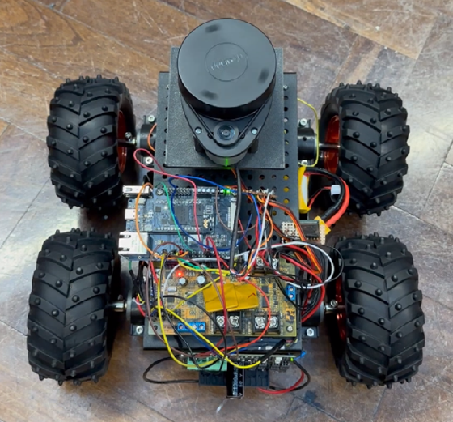

# AML Lab Project - Team Ashla 2023/24 - Imperial College London

## Overview

The Ashla AML Lab Project is dedicated to creating a LiDAR-based system that can identify and classify everyday household objects such as coffee cups, bottles, and hats. This project is designed to support visually impaired individuals by integrating this technology into a self-navigating robot. Utilizing the RPLIDAR A1, our system can perform 360° high-resolution scans, capturing detailed 3D models of the environment and the objects within it.

Our approach includes advanced deep learning algorithms to achieve effective object detection. This document outlines our methodology, including data collection, processing techniques, and the key components that bring our project to life.

## Key Features

- **LiDAR Scanning:** Utilize RPLIDAR A1 for comprehensive 360° environmental scans.
- **Machine Learning:** Implement various machine learning techniques for accurate object detection and classification.
- **Practical Implementation:** Focus on the real-world applicability of the system, ensuring it can be easily integrated into a self-navigating robot.

## System Components

- **RPLIDAR A1:** For high-resolution LiDAR scanning.
- **Arduino:** Acts as the central processing unit, managing data collection and device control.
- **Sensors:** Various sensors for additional data input and navigation.
- **Dagu Wild Thumper 4WD:** The motor system providing mobility to the prototype.
- **Machine Learning Models:** Custom-built models trained on LiDAR scans and 3D models for object recognition.

## Getting Started

### Prerequisites

Before starting, ensure you have the following:

- RPLIDAR A1
- Arduino (with appropriate shields for connectivity)
- Dagu Wild Thumper 4WD chassis (or similar)
- Basic electronic components (wires, sensors, etc.)

### Installation

1. **Set up the RPLIDAR A1:** Follow the manufacturer's instructions to connect the LiDAR to your system.
2. **Prepare the Arduino:** Upload the provided scripts to control the LiDAR and motor system.
3. **Assemble the Robot:** Integrate all components and sensors,

### Usage

To start the system:

1. Power on the robot.
2. Execute the main control script on the Arduino.
3. The robot will begin scanning the environment and navigating autonomously, identifying objects in real-time.

## Acknowledgments

- Gratitude to all project contributors and advisors at Imperial College London for their invaluable feedback and support.
- Special thanks to the developers of the RPLIDAR A1 for their groundbreaking LiDAR technology.
